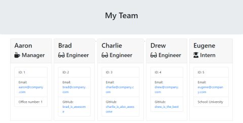
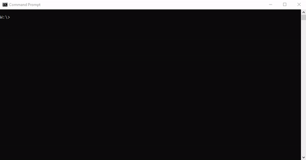
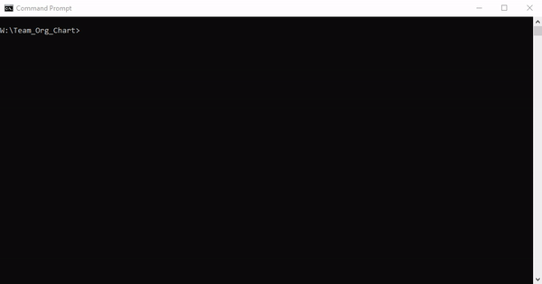
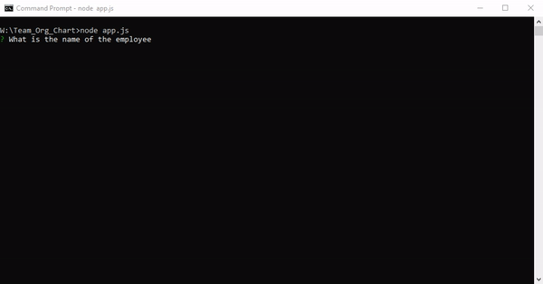
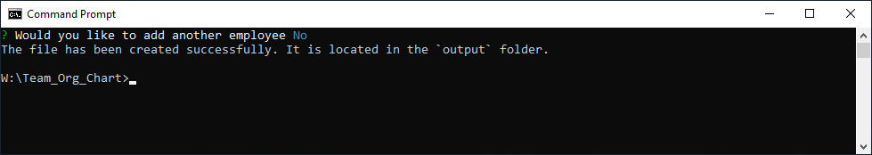
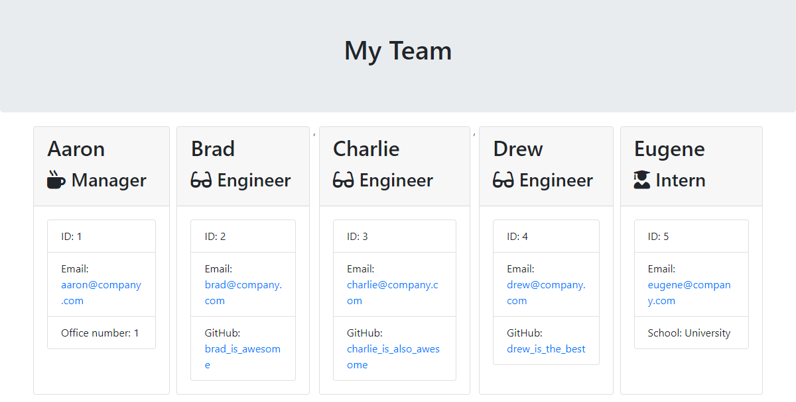

# Team Organization Chart
[](https://opensource.org/licenses/ISC)
[](https://travis-ci.com/Zarlengo/Team_Org_Chart)

## Description
A node.js CLI to dynamically create a team chart for a software engineering team.



## Table of Contents

1. [Installation](#1-installation)
2. [Usage](#2-usage)
3. [License](#3-license)
4. [Contributing](#4-contributing)
5. [Tests](#5-tests)
6. [Questions](#6-questions)

## 1 Installation
1. Download repository
	```
	Git clone https://github.com/Zarlengo/Team_Org_Chart
	```
2. Install dependencies
	```
	npm install
	```
 


## 2 Usage

1. Run app.js
	```
	node app.js
	```



2. Enter the necessary information for an employee:
* [Manager](#manager)
* [Engineer](#engineer)
* [Intern](#intern)


#### Manager
* Enter employee's name
* Enter employee's id number
* Enter employee's email
* Select employee's role ```Manager```
* Enter employee's office number
* Continue adding employees ``` Yes``` or ``` No```



#### Engineer
* Enter employee's name
* Enter employee's id number
* Enter employee's email
* Select employee's role ```Engineer```
* Enter employee's GitHub username
* Continue adding employees ``` Yes``` or ``` No```


#### Intern
* Enter employee's name
* Enter employee's id number
* Enter employee's email
* Select employee's role ```Intern```
* Enter employee's school
* Continue adding employees ``` Yes``` or ``` No```


3. File is created and placed into the output folder



4. Review the generated team webpage

 

## 3 License
    Copyright © 2020 Chris Zarlengo
    Permission to use, copy, modify, and/or distribute this software for any
    purpose with or without fee is hereby granted, provided that the above
    copyright notice and this permission notice appear in all copies.

    THE SOFTWARE IS PROVIDED "AS IS" AND THE AUTHOR DISCLAIMS ALL WARRANTIES
    WITH REGARD TO THIS SOFTWARE INCLUDING ALL IMPLIED WARRANTIES OF
    MERCHANTABILITY AND FITNESS. IN NO EVENT SHALL THE AUTHOR BE LIABLE FOR ANY
    SPECIAL, DIRECT, INDIRECT, OR CONSEQUENTIAL DAMAGES OR ANY DAMAGES
    WHATSOEVER RESULTING FROM LOSS OF USE, DATA OR PROFITS, WHETHER IN AN ACTION
    OF CONTRACT, NEGLIGENCE OR OTHER TORTIOUS ACTION, ARISING OUT OF OR IN
    CONNECTION WITH THE USE OR PERFORMANCE OF THIS SOFTWARE.

## 4 Contributing
* [Zarlengo](https://github.com/Zarlengo)


## 5 Tests
1. Run jest test
	```
	npm run test
	```
* Testing is also run online through a [Constant Integration (CI) provider](https://travis-ci.com/github/Zarlengo/Team_Org_Chart)

## 6 Questions
* [Github Profile for Zarlengo](https://github.com/Zarlengo)
* [Send email to christopher@zarlengo.net](mailto:christopher@zarlengo.net)
* [File an issue](https://github.com/Zarlengo/Team_Org_Chart/issues)
